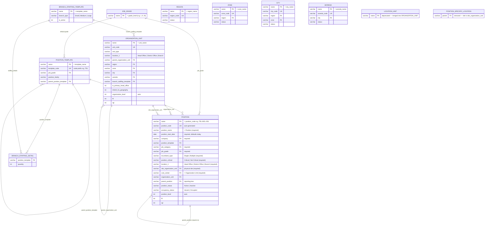

# Organization Structure Module

An enterprise-grade **Position Management & Organization Structure** module for
**Frappe HR**, designed for large banks. It models the institution as **two
independent hierarchies** plus geography on organization units, and lets you
define the whole structure up front — positions exist as vacant *seats* and
employees are attached later.

```
1. Organization Structure (functional + physical sites)  ← Organization Unit  (Nested Set tree)
2. Position Hierarchy     (reporting)                    ← Position           (Nested Set tree)
```

Physical sites (Head Office, District Office, Branch) and their geography
(Region → Zone → City → Woreda) live on **Organization Unit** via **Location 1**
and **Location 2**. There is no separate Location Unit doctype.

`Position` is the bridge: every seat references a reporting **Organization Unit**
cascade and a **Site Organization Unit** (where it sits physically), while
`parent_position` defines the reporting line.

> Employee assignment is intentionally out of scope in this build. The occupancy
> snapshot fields (`occupancy_status`, `is_occupied`, `current_employee`) exist so
> that an assignment layer can be added later without schema changes.

---

## 1. Architecture Overview

```
Organization Unit (tree)                              Position (tree)
  Executive / Function / Department …                   CEO
  Head Office / District Office / Branch (sites)        |-- CTO -> Dev Manager -> Engineers
        \                                                    `-- CFO
         +-------> Position (site + org cascade) <-----+
```

- **Organization Unit** is a Nested Set tree for both reporting structure and
  physical sites (`location_1`: Head Office | District Office | Branch).
- **Position** links to a **Site Organization Unit** for placement and resolves
  reporting via the org cascade (`org_function` … `org_sub_team`).

---

## 2. Entity Relationship Diagram



---

## 3. DocTypes

| DocType | Type | Tree | Key / Naming | Purpose |
|---|---|---|---|---|
| Organization Unit | Setup | Yes | `unit_name` | Functional hierarchy + physical sites |
| Region | Setup | No | `region_name` | Region or city administration |
| Zone | Setup | No | `zone_name` | Zone or sub-city |
| City | Setup | No | `city_name` | City or town |
| Woreda | Setup | No | `woreda_name` | Woreda (kebele area) |
| Position | Setup | Yes | `position_code` (auto) | A seat in the org |
| Position Template | Setup | No | `template_name` | Reusable generic job (carries default `job_grade` + `job_category`) |
| Job Grade | Setup | No | `grade_level` (roman/number) | Pay/rank grade level |
| Branch Staffing Template | Setup | No | `template_name` | Staffing plan per branch type |
| Branch Staffing Detail | Child | – | – | `position_template` × `quantity` rows |
| Position Specific Location | Child | – | – | *(removed)* |
| Job Category | Setup | No | `job_category_name` | Job family classification |

### Position fields

Required fields (shown with a red asterisk on the form): `position_name`
(label **Position**), `position_start_date` (defaults to today), `company`,
`job_category`, `job_grade`, `incumbent_type` (Single / Multiple), `location_1`, `site_organization_unit`,
`cost_center` (a Link to Organization Unit) and `position_critical` (Critical / Not Critical).

Other fields: `position_code` (auto), `position_template`, `organization_unit`,
`position_status` (Active/Inactive), `parent_position`, `is_group`,
`is_head_position`, `position_level` (auto), `occupancy_status` (Vacant/Occupied,
derived), `description`, plus Nested Set columns `lft` / `rgt` / `old_parent`.

When a position is created from a Position Template the **Job Grade** and
**Job Category** default from the template. The auto-generated branch/HQ
positions fill every required field automatically (company falls back to the
default company, and `cost_center` falls back to the position's organization
unit, or the root organization unit for branch seats).

#### Organization Unit (by hierarchy)

The organization unit is chosen through an optional cascade of dropdowns that
follow the org tree: **Function -> Process -> Sub-Process -> Department -> Team
-> Sub-Team**. Each level is filtered to the children of the level above, so
picking a Function only shows its Processes, and so on. None of these are
mandatory. The `organization_unit` field is read-only and resolves to the
deepest level selected; opening a saved position rebuilds the cascade from that
stored unit via `get_organization_hierarchy`.

### Physical location on Organization Unit

Site units use **Location 1** (Head Office | District Office | Branch) and
**Location 2** geography (Region → Zone → City → Woreda). The primary Head
Office can propagate geography to other Head Office units that inherit it.

**Hierarchy rules:**
- Head Office has no site parent requirement (typically under Executive Office).
- District Office must report to a Head Office site.
- Branch must report to a District Office site.

**Branch staffing:** set `branch_staffing_template` on a Branch site; positions
are auto-generated via `organization_unit.create_branch_positions`.

**Pages:** Location Chart (sites with `location_1` set), Organization Chart.

**Reports:** Location Hierarchy, Branch List, District Summary, Branches by
Region / Zone / City / Woreda, Positions by Location.
Branches.

---

## 4. Position Codes (auto-generated)

When `position_code` is left blank it is generated as:

```
<TEMPLATE_CODE>-<LOCATION_CODE or UNIT_CODE>-<NNN>
```

- `TEMPLATE_CODE` comes from the Position Template (e.g. `TEL`, `CSO`, `BM`).
- The place code is the site Organization Unit `unit_code` (e.g. `BOL`, `HQ`).
- `NNN` is a zero-padded running number, unique per prefix.

Examples produced by the sample data: `CEO-HQ-001`, `CTO-HQ-001`, `BM-BOL-001`,
`CSO-BOL-001`, `TEL-BOL-005`, `SG-BOL-002`.

---

## 5. Automatic Branch Staffing

1. Define **Position Templates** (Teller, CSO, …) and a **Branch Staffing
   Template** (e.g. *Medium Branch* → BM×1, CSO×3, Teller×5, Guard×2).
2. Create an **Organization Unit** with **Location 1 = Branch**, set the staffing
   template, and enable `auto_create_positions`.
3. On insert, the branch generates one **Vacant** Position per required seat, with
   auto codes and the grade inherited from each template.

Generation is **idempotent per (template, branch)** — existing seats are counted,
so re-running only tops up missing positions. You can re-trigger it any time from
the Branch site form (**Actions ▸ Generate Positions**) which calls
`organization_unit.create_branch_positions`.

---

## 6. Validations & Business Rules

- **Circular references** are blocked on Organization Unit and Position trees (a
  node cannot be placed under itself or one of its own descendants) —
  `validate_circular_reference`.
- **Position Template** self-loops are blocked independently of the Nested Set.
- **Duplicate position codes** are prevented by the unique key; codes are
  **auto-generated** when blank.
- **Hierarchy levels** (`organization_level`, `location_level`, `position_level`)
  are auto-calculated from the parent and recomputed for the whole subtree when a
  node moves.
- **Multiple root positions are allowed** so thousands of branch seats can exist
  without forcing every one under the CEO on creation. A position with no
  `parent_position` is a valid root (e.g. the CEO); branch seats are generated as
  independent roots and can be re-parented later for succession/reporting.
- **Vacant positions are first-class** — `occupancy_status` defaults to `Vacant`
  and stays authoritative via the occupancy snapshot helper.

---

## 7. Reports, Cards & Charts

**Reports:** Organization Hierarchy, Position Hierarchy (tree), Vacant Positions,
Positions by Organization Unit, Positions by Location, Span of Control, Position
Count by Function, Job Category Distribution.

**Number Cards:** Total Organization Units, Total Locations, Total Branches, Total
Positions, Occupied Positions, Vacant Positions.

**Dashboard Charts:** Positions by Occupancy (donut), Positions by Job Grade (bar).

**Tree Views:** Organization Unit, Location Unit, Position (with a Vacant/Occupied
pill per node).

---

## 8. Sample Data

```bash
# Create grades, templates, staffing plans, org units, the CBO location tree,
# the HQ reporting tree, and auto-generated branch positions (all idempotent)
bench --site <your-site> execute hrms.organization_structure.setup.create_sample_data

# Destructive: wipe all module records, then reseed
bench --site <your-site> execute hrms.organization_structure.setup.reset_sample_data
bench --site <your-site> execute hrms.organization_structure.setup.create_sample_data

# Print computed levels + per-branch position counts
bench --site <your-site> execute hrms.organization_structure.setup.verify_sample_data

# Confirm workspace, sidebar, doctypes, number cards and reports are installed
bench --site <your-site> execute hrms.organization_structure.setup.diagnose
```

The sample data builds the **Cooperative Bank of Oromia** location tree
(Head Office, Addis & Oromia Districts, five branches) and produces 60 vacant
positions across the HQ reporting tree and the branches.

---

## 9. Enterprise Deployment Notes

1. **Structure before people.** Build the three trees and let branches generate
   their vacant seats; attach employees later through an assignment layer.
2. **Use stable codes.** `unit_code` / `location_code` / `template_code` drive the
   generated position codes and are safe to integrate with payroll / IAM.
3. **Scale.** All trees are Nested Set with indexed `lft`/`rgt`; staffing
   generation is per-branch and idempotent, so tens of thousands of positions
   across thousands of branches remain manageable.
4. **Governance.** Re-parenting a node rebuilds nested-set boundaries and
   recomputes levels for the subtree — schedule large reorganizations off-peak and
   review with the Span of Control report afterwards.
5. **Auditing.** `track_changes` is enabled on the masters; combine with Frappe
   Document Versions for compliance.

---

## 10. Module Layout

```
organization_structure/
├── doctype/
│   ├── organization_unit/       # functional Nested Set tree + tree view
│   ├── location_unit/           # geographical Nested Set tree + auto-staffing
│   ├── position/                # reporting Nested Set tree + auto codes
│   ├── position_template/       # reusable job definitions
│   ├── job_grade/               # pay/rank grades
│   ├── branch_staffing_template/# staffing plan (parent)
│   ├── branch_staffing_detail/  # staffing plan rows (child table)
│   └── job_category/            # optional job family
├── report/                      # 8 script reports
├── number_card/                 # 6 dashboard cards
├── dashboard_chart/             # 2 charts
├── page/organization_chart/     # top-down org chart
├── workspace/organization_structure/
├── fixtures/                    # workspace, sidebar, desktop icon (bind-mount sync)
├── setup.py                     # sample data + verify / diagnose / refresh helpers
└── README.md
```

> **Workspace edits:** Frappe only re-imports a workspace on `bench migrate` when
> the JSON's `modified` timestamp is newer than the database copy. After editing
> the workspace, bump its `modified` value (or run
> `setup.refresh_module`) before migrating.
